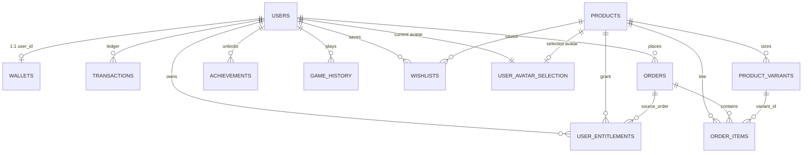

# Database architecture (public)

This diagram matches the reference snapshot in [`schema.sql`](./schema.sql), synced from Supabase project **first-igaming-project** (`fjduloefmqtohtnkqtfp`) on **2026-04-11**.

`auth.users` is Supabase Auth; `public.users` links via `auth_user_id`. Orders store `coupon_code` as text (no FK to `coupons`).

## ER diagram (core relationships)

`coupons` 為獨立表；結帳時依 `code` 套用，`orders.coupon_code` 僅存文字，**無外鍵**連到 `coupons`。

## Public RPCs (high level)

| Name | Role |
|------|------|
| `checkout_shop_order` | Client checkout: lines, optional coupon, shipping JSON → JSON result |
| `admin_search_orders` | Admin list/filter orders |
| `admin_search_transactions` | Admin list/filter transactions |
| `get_admin_dashboard_stats` | Aggregated dashboard JSON |

Triggers on the live DB include `handle_new_auth_user`, `touch_updated_at`, `enforce_transaction_limits`, `enforce_user_avatar_selection`, and an `rls_auto_enable` event trigger; DDL lives in the phase migration files, not in `schema.sql`.

## Storage (conceptual)

Buckets used by the app (policies in migrations): e.g. `shop-products`, `user-avatars`. Not represented as SQL tables above.
