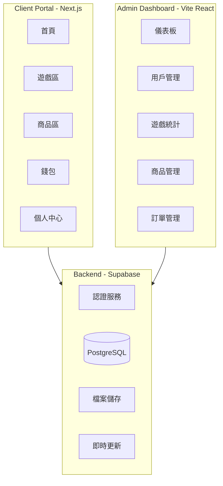

# vAcAnt 虛擬博弈網站作品集開發計劃

> **文件對齊聲明**：本計劃以目前 repo 程式碼與 `docs/sql/schema.sql`（現行 Supabase schema 快照）為準。若本文描述與實際程式或資料庫有差異，請以程式與 schema 實際內容為最終依據。

## 專案架構總覽



## 技術棧

- **前端用戶端**: Next.js 16 + React 19 + Tailwind CSS 4
- **管理後台**: Vite + React 19
- **後端服務**: Supabase (Auth + PostgreSQL + Storage)
- **狀態管理**: Zustand
- **動畫**: Framer Motion
- **圖表**: Recharts (後台)
- **部署**: Vercel

---

## Phase 1: 基礎架構與認證系統

### 1.1 專案設定與共用元件

在 [client-portal/](client-portal/) 設定：

- 安裝必要套件: `zustand`, `framer-motion`, `@supabase/supabase-js`
- 建立深色主題的 Tailwind 配置
- 建立共用 UI 元件: Button, Card, Modal, Input, Avatar
- 設定 Supabase Client

### 1.2 認證系統

- 訪客模式: 自動建立臨時帳號並儲存於 localStorage
- Google OAuth 登入: 整合 Supabase Auth
- 登入/註冊 Modal 元件

### 1.3 資料庫設計 (Supabase)

```
enums
├── transaction_type (deposit/withdraw/bet/win/purchase/claim/wager/payout)
├── order_status (pending/paid/shipped/completed/cancelled)
└── coupon_discount_type (percentage/fixed/free_shipping)

users
├── id (uuid, PK)
├── auth_user_id (FK -> auth.users, unique)
├── email
├── display_name
├── avatar_url
├── created_at
├── is_guest (boolean)
└── banned_at

wallets
├── id (uuid, PK)
├── user_id (FK -> users)
├── coin_balance (vAcAnt Coins)
├── btc_balance
├── eth_balance
└── updated_at

transactions
├── id (uuid, PK)
├── user_id (FK)
├── type (transaction_type)
├── currency (VAC)
├── amount
├── status (pending/completed/failed)
├── balance_after
├── description
├── game_id
├── theme_id
├── round_id
├── metadata (JSON)
└── created_at

game_history
├── id (uuid, PK)
├── user_id (FK)
├── game_type
├── bet_amount
├── win_amount
├── result (JSON)
└── played_at

achievements
├── id (uuid, PK)
├── user_id (FK)
├── achievement_type
└── unlocked_at

products
├── id (uuid, PK)
├── name
├── description
├── price
├── category
├── image_url
├── stock
├── is_active
├── slug
├── fulfillment_type (physical/digital)
├── is_avatar
├── image_bucket / image_object_path
├── price_vac
├── force_sold_out
├── sort_order
└── created_at / updated_at

product_variants
├── id (uuid, PK)
├── product_id (FK)
├── size (XS/S/M/L/XL, nullable)
├── stock_quantity
└── created_at / updated_at

orders
├── id (uuid, PK)
├── user_id (FK)
├── total_amount
├── status (order_status)
├── shipping_info (JSON)
├── fulfillment_type
├── subtotal_vac / shipping_fee_vac / discount_vac / total_vac
├── coupon_code
├── shipping_snapshot (JSON)
└── created_at / updated_at

order_items
├── id (uuid, PK)
├── order_id (FK)
├── product_id (FK)
├── quantity
├── price_at_purchase
├── variant_id (FK -> product_variants)
├── unit_price_vac / line_total_vac
├── size_snapshot
└── created_at

wishlists
├── id (uuid, PK)
├── user_id (FK)
└── product_id (FK)

coupons
├── id (uuid, PK)
├── code
├── discount_type (coupon_discount_type)
├── discount_value
├── min_purchase
├── expires_at
├── is_active
├── applies_fulfillment (physical/digital/any)
├── title
├── internal_note
└── created_at / updated_at / deleted_at

user_entitlements
├── id (uuid, PK)
├── user_id (FK)
├── product_id (FK)
├── entitlement_type (avatar/digital_item)
├── source_order_id (FK -> orders)
└── granted_at

user_avatar_selection
├── user_id (PK, FK -> users)
├── avatar_product_id (FK -> products)
└── updated_at
```

---

## Phase 2: 核心 UI 與導航

### 2.1 網站佈局

- **Header**: Logo, 導航選單, 錢包餘額, 用戶頭像
- **Sidebar** (可收合): 遊戲分類, 商店入口
- **Footer**: vAcAnt 品牌資訊, 連結

### 2.2 vAcAnt Logo 加載動畫系統

目前以 `client-portal/src/components/loading/README.md` 為準，重點如下：

- 使用 `SplashScreen` + `useSplashVisibility`，以真實狀態驅動並用 `minVisibleMs` 防閃爍。
- 全站 Auth 初始化由 `ClientLayoutShell` 掛 `SplashScreen mode="fullscreen"`。
- 商店路由 loading 使用 `SplashScreen mode="inline"`（只覆蓋 main 內容區）。
- `GameLoadingScreen`、`LogoLoader` 目前保留為可選元件（repo 內尚未實際引用）。
- 動畫核心仍是 Logo 淡入縮放 + 霓虹脈動，不使用假進度條。

### 2.3 主要頁面路由

```
/                    # 首頁 (遊戲總覽 + 精選商品)
/games               # 遊戲大廳
/games/slots         # 老虎機列表
/games/slots/[id]    # 單一老虎機遊戲
/games/blackjack     # 二十一點
/games/baccarat      # 百家樂
/games/lottery       # 彩票遊戲
/shop                # 商品列表
/shop/[id]           # 商品詳情
/cart                # 購物車
/checkout            # 結帳
/profile             # 個人中心
/profile/history     # 遊戲歷史
/profile/orders      # 訂單歷史（Phase 5.5）
/profile/achievements # 成就
/wallet              # 錢包
/auth/callback       # Google OAuth 回跳：兌換 code → session → 導回 next
```

**落地實作補充（Next.js App Router / Route Groups）：**

- **主站殼（Header/Sidebar/Footer）只套在 `(lobby)`**：避免 `/auth/callback` 這種純流程頁面出現 UI 抖動。
- **Auth callback 放在 `(auth)`**：URL 仍是 `/auth/callback`，但不會套主站殼。
- **Profile 使用 nested layout**：`/profile/*` 共用 `profile/layout.tsx` 來提供 tabs（總覽/歷史/訂單/成就）。

**實際檔案結構（對照 2.3 路由）：**

```
client-portal/src/app/
├── layout.tsx                     # Root layout：AuthProvider / AuthModal / globals.css
├── (auth)/
│   └── auth/callback/page.tsx     # /auth/callback（不套主站殼）
└── (lobby)/
    ├── layout.tsx                 # 主站殼：ClientLayoutShell（Header/Sidebar/Footer）
    ├── page.tsx                   # /
    ├── games/
    │   ├── page.tsx               # /games
    │   ├── slots/
    │   │   ├── page.tsx           # /games/slots
    │   │   └── [id]/page.tsx      # /games/slots/[id]
    │   ├── blackjack/page.tsx     # /games/blackjack
    │   ├── baccarat/page.tsx      # /games/baccarat
    │   └── lottery/page.tsx       # /games/lottery
    ├── shop/
    │   ├── page.tsx               # /shop
    │   └── [id]/page.tsx          # /shop/[id]
    ├── cart/page.tsx              # /cart
    ├── checkout/page.tsx          # /checkout
    ├── wallet/page.tsx            # /wallet
    └── profile/
        ├── layout.tsx             # /profile/* tabs 共用 layout
        ├── page.tsx               # /profile
        ├── history/page.tsx       # /profile/history
        ├── orders/page.tsx        # /profile/orders
        └── achievements/page.tsx  # /profile/achievements
```

> 註：目前 `/games/slots/[id]`、`/shop/[id]` 以 `params.id` 當作識別，先做 UI 殼與 placeholder；後續再串接真資料與狀態管理。

---

## Phase 3: 虛擬貨幣與錢包系統

### 3.1 錢包功能

- 餘額顯示以 **vAcAnt Coins (VAC)** 為主幣（唯一可操作幣別）
- BTC / ETH / USDT 改為 **由 VAC 即時換算顯示**（僅估值，不作為可持有餘額）
- 模擬充值介面（點按鈕即可加 VAC）
- 模擬提領介面（建立 pending 申請）
- 交易紀錄列表（類型篩選、分頁）
- 充值防濫用：單筆 200,000 VAC、每分鐘最多 10 筆、每日總額 5,000,000 VAC
- **資料持久化策略**：
  - 訪客模式：資料存在瀏覽器（localStorage）
  - 登入用戶：寫入 Supabase（wallets + transactions）

### 3.2 免費領取系統

- 「領取免費幣」按鈕（首頁高亮 CTA + 錢包頁入口）
- 每次領取 6,767 vAcAnt Coins
- 冷卻 1.5 秒
- 每日最多 677 次（約 4,581,259 VAC / 日）
- 記錄到交易紀錄（`type=claim`）
- 登入後同步寫入 Supabase；訪客模式維持本地紀錄

### 3.3 防濫用限制（錢包）

- 充值（deposit）單筆上限：200,000 VAC
- 充值（deposit）每分鐘上限：10 筆
- 充值（deposit）每日總額上限：5,000,000 VAC

---

## Phase 4: 博弈遊戲

### 4.1 老虎機 (Slots) - 3 個主題

> 整體視覺走 **Italian Brainrot + vAcAnt 品牌** 混合風格：AI 生成怪物、霓虹賭場感、假義大利文角色名。

| 主題                       | 說明                                                             |
| -------------------------- | ---------------------------------------------------------------- |
| **vAcAnt Classic**         | 品牌主題，霓虹馬 + vAcAnt logo，轉輪圖案結合籌碼、馬頭與霓虹字   |
| **Cyber Neon**             | 賽博龐克風格，夜城霓虹、故障特效、機械籌碼                       |
| **Italian Brainrot Slots** | 以 Italian Brainrot 宇宙為主題，所有圖標皆為腦爛角色與其代表物件 |

**Italian Brainrot Slots 主要角色與圖示：**

- Tralalero Tralala：三腳鯊魚穿 Nike 球鞋，作為最高獎倍率符號之一
- Tung Tung Tung Sahur：拿平底鍋敲鐘的夜宵守門人，搭配鍋子與月亮圖示
- Bombardiro Crocodilo：背著炸彈的鱷魚，出現時觸發隨機倍數炸開（Multiplier Bomb）
- Brr Brr Patapim：拿喇叭的小惡魔，出現時觸發 Free Spin 或 Re-Spin
- Lirili Larila：手拿小提琴的詭異演奏家，搭配音符 Scatter 符號
- 「仙人掌大象」：**Elefanto Cactuso**（elephant with a cactus for a body），可作為 Wild 角色替代其他符號
- 額外可延伸 2-3 個小角色（如義大利麵章魚、披薩天使）作為低倍率符號增加豐富度

功能:

- 3x5 格子轉盤
- 轉動動畫 (Framer Motion)
- 連線判定與獎勵計算
- 自動轉/快速轉模式
- 下注金額調整（**只用 totalBet**，不提供選線）
- 錢包結算流程：下注成立先扣款（wager），停輪後依 `totalCredits` 派彩（payout）
- 交易紀錄保留 `game_id/theme_id/round_id`，可對帳每一局 slots

### 4.2 二十一點 (Blackjack)

> 本桌採用 **Italian Brainrot 主題**，牌桌為霓虹腦爛賭場風格，視覺風格與 `Italian Brainrot Slots`、Lottery 統一。

**client-portal 實作狀態（可玩原型）**

- 路由：`/games/blackjack`；大廳 `/games` 以 `GameThemeCard` 展示；首頁熱門區含 Blackjack 圖卡。
- 程式說明文件：`docs/blackjack-client-portal-overview.md`（檔案分工、錢包流程、白話對照）。
- 錢包：`placeBlackjackWager`（先扣款）→ `applyBlackjackPayout`（結算派彩，含 0）；`game_id: blackjack`，帶 `theme_id` / `round_id`。
- 規則（純函式於 `client-portal/src/games/blackjack/logic/game.ts`）：自然 Blackjack 3:2、莊家 **S17**、**DAS**、分牌最多 4 手、**分 A 僅再發一張**、五張牌階級（大／小過五關等）與結算比階。
- 隨機：`roundId` 派生種子洗牌（`logic/rng.ts`），介面預留日後改伺服器 seed。

**角色與 UI 對應（以現有實作與美術為準；與下方舊稿若有出入，以程式為主）**

- **莊家**：**Tung Tung Tung Sahur**（平底鍋／鍾聲系），發牌與結算時切換 idle／win／lose 立繪（`dealer_triplet_*.png`）。
- **桌邊吉祥物**：**Brr Brr Patapim**（輸局或受擊提示、受傷立繪）、**Bombardiro Crocodilo**（贏局時飛向 Brr 再飛回 idle，純視覺）。
- 牌背／籌碼：沿用共用 chip card 資產與 Brainrot 霓虹配色；**Elefanto Cactuso** 桌角裝飾可後續補強。

> 原計畫曾以 **Lirili Larila** 為莊家、Brr 為提示員；**目前畫面**改為 Tung 莊家 + Brr／Bombardiro 邊緣演出，仍屬同一宇宙，日後若要小提琴莊家可替換立繪與動畫層。

> 本遊戲中的所有角色皆與 4.1 的 `Italian Brainrot Slots` 與 4.4 彩票遊戲共用同一宇宙與美術資產，方便後續行銷與成就系統整合。

### 4.3 百家樂 (Baccarat)

> 本桌使用 **Italian Brainrot 宇宙角色** 作為「閒 / 莊 / 和」的象徵，保留原本百家樂玩法與下注選項。

**client-portal 實作狀態（可玩原型，以程式為準）**

- 路由：`/games/baccarat`；大廳 `/games` 以 `GameThemeCard` 展示（圖卡 `public/games/baccarat/bc_card_v2.png` 等）。
- 程式說明文件：`docs/baccarat-client-portal-overview.md`（檔案分工、錢包流程、白話對照）。
- 錢包：`placeBaccaratWager`（先扣款）→ `applyBaccaratPayout`（結算派彩，含 0）；`game_id: baccarat`，帶 `theme_id` / `round_id`。
- 規則（純函式於 `client-portal/src/games/baccarat/logic/game.ts`）：計點 mod 10、標準第三張表、派彩閒 1:1／莊 0.95／和 8:1；非和下注遇和局 Push。
- 隨機：與 Blackjack 共用牌組與 `roundId` 種子洗牌（`blackjack/logic/rng`），介面預留日後改伺服器 seed。
- UI：左側桌布 + 牌區 + `MascotLayer`（Tralalero／Lirili 常駐，Tung 依贏錢或和局）；右側下注與**單一主按鈕**逐步翻牌／補牌／結算；簡化路單 24 格。
- 單元測試：`client-portal/src/games/baccarat/logic/game.test.ts`。

> 本遊戲中的「閒 / 莊 / 和」角色，同樣與 Slots 與 Lottery 共用 Italian Brainrot 角色設定，讓玩家在不同遊戲中對角色有連續記憶感。

### 4.4 彩票遊戲 (Lottery) - Italian Brainrot 設定

> 彩票區延續 Italian Brainrot 世界觀；目前 `client-portal` 已上架 3 張主題圖卡，玩法入口先標示「即將開放」。

**client-portal 目前狀態（以程式為準）**

- 路由：`/games/lottery` 為彩票列表頁（3 張 `GameThemeCard`），由 sidebar 的 `Lottery 彩票` 進入。
- 大廳：`/games` 已顯示 3 張彩票主題卡，皆為 `coming_soon`（不可點入遊玩）。
- 圖卡資產：`client-portal/public/games/lottery/`（`lucky_wheel_card.png`、`scratch_card_card.png`、`number_lottery_card.png`）。

| 遊戲 | 主角與視覺方向 |
| --- | --- |
| **Lucky Wheel 轉盤** | 以 **Brr Brr Patapim** 為主角，站在茂密樹林中的幸運轉盤旁；畫面包含輪盤、籌碼、骰子、撲克牌等賭場元素。 |
| **Scratch Card 刮刮樂** | 以 Italian Brainrot 五角（Tralalero Tralala、Bombardiro Crocodilo、Tung Tung Tung Sahur、Lirilì Larilà、Brr Brr Patapim）為主；呈現角色與鈔票由刮刮樂面中衝出的動態感。 |
| **Number Lottery 數字彩** | 以 **Bombardiro Crocodilo** 為主角，在天空主題場景中轟炸出數字彩票；視覺重點數字統一為 **67**，搭配數字球與彩票抽獎元素。 |

> 三款彩票主題的色彩與插畫語言持續與 4.1 的 Italian Brainrot Slots 對齊，方便後續共用素材到行銷頁、活動 banner 與成就系統。

---

## Phase 5: 購物車與商品系統

### 5.1 商品展示

- 商品卡片元件 (圖片、名稱、價格、加入購物車)
- 商品詳情頁 (大圖、描述、數量選擇)
- 分類篩選 (服飾/數位/收藏品)

### 5.2 商品清單 (5-10 個)

| 類別     | 商品範例                           |
| -------- | ---------------------------------- |
| 服飾     | vAcAnt Logo Tee, Neon Horse Hoodie |
| 數位商品 | 專屬頭像 , VIP 會員資格            |
| 收藏品   | 限量馬雕像, 簽名海報               |

### 5.3 購物車功能

- 加入/移除商品
- 調整數量
- 優惠券輸入與驗證
- 計算總價 (含折扣)

### 5.4 結帳流程

1. 購物車確認
2. 收件資訊填寫 (模擬)
3. 確認訂單
4. 扣除 vAcAnt Coins
5. 訂單完成頁面

### 5.5 訂單歷史

- 訂單列表
- 訂單詳情 (商品、金額、狀態)

### 實作狀態（本 repo）

- **Client**：購物車／結帳／成功頁、個人中心訂單列表與詳情、錢包交易類型、`dbProductId` 與 `checkout_shop_order` RPC 串接已完成；金額試算與 payload 組裝有單元測試（`cartSummary`、`shopCheckout`、`stock`）。
- **資料庫**：依賴 `docs/sql/phase-6-shop-orders-migration.sql` 與 `phase-6-shop-checkout-rpc-migration.sql`（及優惠券相關 migration），執行順序見 **`docs/sql/README.md`**。
- **變更檔案白話說明**：見 **`docs/phase-5-shop-client-changes.md`**。

---

## Phase 6: 用戶個人中心

### 6.1 個人資料

- 顯示/編輯用戶名稱
- 頭像上傳 (Supabase Storage)
- 帳戶統計摘要

### 6.2 遊戲歷史

- 列表顯示所有遊戲紀錄
- 篩選 (依遊戲類型/日期)
- 統計: 總遊戲次數、總贏取金額

### 實作狀態（本 repo）

- **Client**：`/profile/history` 已從 placeholder 改為可用頁面，含登入擋板、遊戲類型/日期篩選、RWD 表格、分頁、錯誤重試與統計卡。
- **資料來源定義**：以 `transactions` 的 `payout`（`currency=VAC`、`status=completed`）作為每局結算紀錄；統計「總遊戲次數」為符合條件的 payout 筆數，「總贏取金額」為 payout 金額總和。
- **測試**：`historyUtils` 已有單元測試覆蓋數值轉換、日期區間、row 映射與總額聚合。

### 6.3 成就系統

| 成就     | 條件              |
| -------- | ----------------- |
| 新手上路 | 完成第一場遊戲    |
| 幸運之星 | 單次贏取 10,000+  |
| 購物狂   | 完成第一筆訂單    |
| 收藏家   | 擁有 3 個以上頭像 |
| VIP 玩家 | 總遊戲次數達 67   |

### 實作狀態（本 repo）

- **Client**：`/profile/achievements` 已從 placeholder 改為可用頁面，含登入擋板、解鎖進度、Locked/Unlocked 狀態、解鎖時間與錯誤重試。
- **解鎖策略**：採「進頁批次補發」；進入成就頁時計算是否達標，將尚未入庫但已達標的成就寫入 `public.achievements`。
- **收藏家規則**：目前改為「擁有 3 個以上頭像」，只計 `user_entitlements.entitlement_type = 'avatar'`。
- **資料庫**：新增 migration `docs/sql/phase-6-profile-achievements-migration.sql`（RLS + `(user_id, achievement_type)` 唯一索引，避免重複解鎖）。

---

## Phase 7: 管理後台

在 [admin-dashboard/](admin-dashboard/) 開發:

### 7.1 儀表板首頁

- 總用戶數
- 今日活躍用戶
- 總遊戲次數
- 總交易金額
- 圖表: 每日活躍用戶趨勢、遊戲類型分布

### 7.2 用戶管理

- 用戶列表 (搜尋、分頁)
- 用戶詳情 (餘額、遊戲記錄、訂單)
- 停權/啟用功能
- 移除用戶資料（匿名化）：清除姓名、Email、頭像並停權，保留遊戲紀錄與訂單統計；需在危險操作區輸入 Email（或訪客 ID 前 8 碼）確認後才可執行

### 7.3 遊戲統計

- 各遊戲的遊玩次數
- 獲利/虧損統計
- 熱門時段分析

### 7.4 交易紀錄

- 所有交易列表
- 篩選 (類型/日期/金額)

### 7.5 商品管理

- 商品 CRUD
- 圖片上傳
- 庫存管理

### 7.6 訂單管理

- 訂單列表
- 更新訂單狀態
- 訂單詳情

### 7.7 優惠券管理

- 優惠券列表（代碼、折扣類型、折扣值、最低消費、適用範圍、到期日、狀態）
- 新增 / 編輯優惠券（Modal 表單）
- 啟用 / 停用 toggle
- 軟刪除（保留審計軌跡）

### 實作狀態（本 repo）

- **Admin**：`/settings` 路由已從「網站設定」改為「優惠券管理」（`CouponsPage`）。
- 移除原有「免費幣領取金額設定」區塊；頁面專注優惠券 CRUD。
- 操作欄：Pencil 開啟編輯 Modal，ToggleRight/Left 獨立控制啟用狀態，Trash2 軟刪除。
- 新增 / 編輯 Modal 欄位：優惠碼、標題、折扣類型（百分比 / 固定金額）、折扣值、最低消費、適用訂單類型、到期日（留空 = 永久）、內部備注、啟用狀態。
- 權限模型已落地：後台與資料庫一致採 `app_metadata.role = 'admin'` 作為管理員判斷來源。
- RLS 已收斂：`products` / `product_variants` / `coupons` 的寫入改為 admin-only，避免一般 authenticated 直接寫入。
- 敏感 RPC（admin search / dashboard stats / checkout）已撤銷 `PUBLIC` / `anon` execute，只保留 `authenticated` 與後端角色。
- 優惠券維持軟刪除（`deleted_at`）：資料保留於 DB 供審計，後台可切換顯示已刪除項目。

### 7.8 安全與授權（已落地）

- **授權來源一致化**：前後台與 RLS 統一使用 `app_metadata.role`；不再以 `user_metadata.role` 作為最終授權依據。
- **最小權限原則**：
  - 前台讀取 coupon 僅限 active + 未刪除；
  - 商品、規格、優惠券寫操作僅 admin 可執行；
  - admin RPC 仍有函式內 role 檢查，避免 UI 被繞過時直接濫用。
- **審計可追蹤**：優惠券刪除採 soft-delete，保留歷史紀錄供後台稽核與後續還原。

---

## Phase 8: 收尾與部署

### 8.1 響應式設計

- 確保所有頁面在手機/平板上正常顯示
- 遊戲介面的觸控優化

### 8.2 效能優化

- 圖片優化 (Next.js Image)
- 程式碼分割
- Loading 狀態處理

### 8.3 部署

- 設定 Vercel 專案
- 環境變數配置
- 建立 Production Supabase 專案

### 8.4 README 與文檔

- 專案說明
- 技術架構圖
- 如何本地運行

---

## 建議開發順序

為了讓你能盡快有東西可以展示，建議按以下優先順序開發:

1. **先做核心體驗**: 首頁 + 1個老虎機遊戲 + 錢包基本功能
2. **完善遊戲區**: 其他遊戲
3. **加入購物功能**: 商品 + 購物車
4. **用戶系統**: 認證 + 個人中心
5. **管理後台**: 基本 CRUD + 圖表
6. **細節打磨**: 動畫 + 響應式 + 優化
