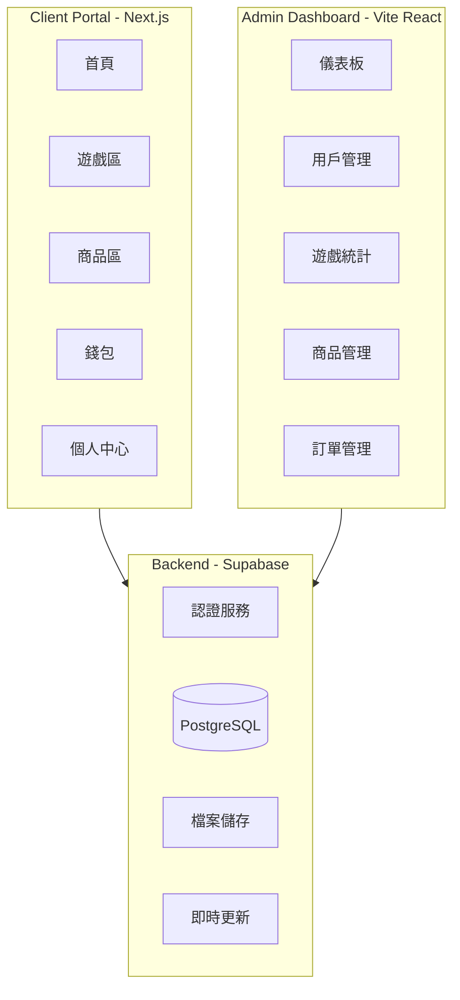

# vAcAnt 虛擬博弈網站作品集開發計劃

## 專案架構總覽



## 技術棧

- **前端用戶端**: Next.js 16 + React 19 + Tailwind CSS 4
- **管理後台**: Vite + React 19
- **後端服務**: Supabase (Auth + PostgreSQL + Storage)
- **狀態管理**: Zustand
- **動畫**: Framer Motion
- **圖表**: Recharts (後台)
- **部署**: Vercel

---

## Phase 1: 基礎架構與認證系統

### 1.1 專案設定與共用元件

在 [client-portal/](client-portal/) 設定：

- 安裝必要套件: `zustand`, `framer-motion`, `@supabase/supabase-js`
- 建立深色主題的 Tailwind 配置
- 建立共用 UI 元件: Button, Card, Modal, Input, Avatar
- 設定 Supabase Client

### 1.2 認證系統

- 訪客模式: 自動建立臨時帳號並儲存於 localStorage
- Google OAuth 登入: 整合 Supabase Auth
- 登入/註冊 Modal 元件

### 1.3 資料庫設計 (Supabase)

```
users
├── id (uuid, PK)
├── email
├── display_name
├── avatar_url
├── created_at
└── is_guest (boolean)

wallets
├── id (uuid, PK)
├── user_id (FK -> users)
├── coin_balance (vAcAnt Coins)
└── updated_at

transactions
├── id (uuid, PK)
├── user_id (FK)
├── type (deposit/withdraw/claim/bet/win/purchase)
├── currency
├── amount
├── status (pending/completed/failed)
├── balance_after
├── description
└── created_at

game_history
├── id (uuid, PK)
├── user_id (FK)
├── game_type
├── bet_amount
├── win_amount
├── result (JSON)
└── played_at

achievements
├── id (uuid, PK)
├── user_id (FK)
├── achievement_type
└── unlocked_at

products
├── id (uuid, PK)
├── name
├── description
├── price (in coins)
├── category
├── image_url
├── stock
└── is_active

orders
├── id (uuid, PK)
├── user_id (FK)
├── total_amount
├── status
├── shipping_info (JSON)
└── created_at

order_items
├── id (uuid, PK)
├── order_id (FK)
├── product_id (FK)
├── quantity
└── price_at_purchase

wishlists
├── id (uuid, PK)
├── user_id (FK)
└── product_id (FK)

coupons
├── id (uuid, PK)
├── code
├── discount_type (percentage/fixed)
├── discount_value
├── min_purchase
├── expires_at
└── is_active
```

---

## Phase 2: 核心 UI 與導航

### 2.1 網站佈局

- **Header**: Logo, 導航選單, 錢包餘額, 用戶頭像
- **Sidebar** (可收合): 遊戲分類, 商店入口
- **Footer**: vAcAnt 品牌資訊, 連結

### 2.2 vAcAnt Logo 加載動畫系統

建立統一的加載動畫元件，使用品牌 Logo 搭配霓虹發光 + 淡入縮放效果。重點是「**以真實載入狀態驅動**」，避免假進度條或純計時器造成誤導與干擾。

**動畫效果組合：**

```
1. 初始狀態：Logo 縮小 (scale: 0.8)、透明 (opacity: 0)
2. 進場動畫：淡入 + 放大到正常大小 (0.5s ease-out)
3. 持續效果：霓虹發光脈動 (glow pulse, 1.5s 週期)
4. 退場動畫：淡出 + 略微放大 (0.3s ease-in)
```

**使用場景：**

| 場景               | 元件                  | 動畫行為                                                                             |
| ------------------ | --------------------- | ------------------------------------------------------------------------------------ |
| 網站初次載入       | `<SplashScreen>`      | **接近全螢幕** Logo 動畫；由 auth/初始化狀態驅動，並提供「最短可見時間」避免一閃而過 |
| 後續載入（非初次） | `<SplashScreen>`      | **只覆蓋 main 內容區**；Header/Sidebar/Footer 必須一直可見                           |
| 遊戲載入           | `<GameLoadingScreen>` | Logo + 遊戲名稱 + 提示文字；由各遊戲頁面自身 `isLoading` 狀態驅動                    |
| 局部資料載入       | `<LogoLoader>`        | 小型 Logo 脈動效果；用在按鈕/卡片等局部區塊                                          |

**技術實現：**

- 使用 Framer Motion 的 `motion.div` 處理淡入縮放
- CSS `filter: drop-shadow()` + `@keyframes` 做霓虹發光效果
- 發光主色：青色 (#00ffff) 配合深色主題
- 建立 `components/loading/` 資料夾統一管理
- **禁止假進度條**：除非有真實 progress 來源，否則只顯示 Logo + 文案提示
- **防閃爍策略**：提供 `minVisibleMs`（例如 300–600ms）改善載入很快時一閃而過
- **精簡原則**：不做頁面切換過場（移除 `PageTransition`），避免過度 loading 干擾

**元件檔案結構：**

```
client-portal/src/components/loading/
├── SplashScreen.tsx      # 初次載入接近全螢幕 / 後續載入只覆蓋 main
├── NeonLogoWrapper.tsx   # 霓虹動畫容器（共用）
├── GameLoadingScreen.tsx # 遊戲載入畫面
└── LogoLoader.tsx        # 小型載入指示器
```

### 2.3 主要頁面路由

```
/                    # 首頁 (遊戲總覽 + 精選商品)
/games               # 遊戲大廳
/games/slots         # 老虎機列表
/games/slots/[id]    # 單一老虎機遊戲
/games/blackjack     # 二十一點
/games/baccarat      # 百家樂
/games/lottery       # 彩票遊戲
/shop                # 商品列表
/shop/[id]           # 商品詳情
/cart                # 購物車
/checkout            # 結帳
/profile             # 個人中心
/profile/history     # 遊戲歷史
/profile/orders      # 訂單歷史
/profile/achievements # 成就
/wallet              # 錢包
/auth/callback       # Google OAuth 回跳：兌換 code → session → 導回 next
```

**落地實作補充（Next.js App Router / Route Groups）：**

- **主站殼（Header/Sidebar/Footer）只套在 `(lobby)`**：避免 `/auth/callback` 這種純流程頁面出現 UI 抖動。
- **Auth callback 放在 `(auth)`**：URL 仍是 `/auth/callback`，但不會套主站殼。
- **Profile 使用 nested layout**：`/profile/*` 共用 `profile/layout.tsx` 來提供 tabs（總覽/歷史/訂單/成就）。

**實際檔案結構（對照 2.3 路由）：**

```
client-portal/src/app/
├── layout.tsx                     # Root layout：AuthProvider / AuthModal / globals.css
├── (auth)/
│   └── auth/callback/page.tsx     # /auth/callback（不套主站殼）
└── (lobby)/
    ├── layout.tsx                 # 主站殼：ClientLayoutShell（Header/Sidebar/Footer）
    ├── page.tsx                   # /
    ├── games/
    │   ├── page.tsx               # /games
    │   ├── slots/
    │   │   ├── page.tsx           # /games/slots
    │   │   └── [id]/page.tsx      # /games/slots/[id]
    │   ├── blackjack/page.tsx     # /games/blackjack
    │   ├── baccarat/page.tsx      # /games/baccarat
    │   └── lottery/page.tsx       # /games/lottery
    ├── shop/
    │   ├── page.tsx               # /shop
    │   └── [id]/page.tsx          # /shop/[id]
    ├── cart/page.tsx              # /cart
    ├── checkout/page.tsx          # /checkout
    ├── wallet/page.tsx            # /wallet
    └── profile/
        ├── layout.tsx             # /profile/* tabs 共用 layout
        ├── page.tsx               # /profile
        ├── history/page.tsx       # /profile/history
        ├── orders/page.tsx        # /profile/orders
        └── achievements/page.tsx  # /profile/achievements
```

> 註：目前 `/games/slots/[id]`、`/shop/[id]` 以 `params.id` 當作識別，先做 UI 殼與 placeholder；後續再串接真資料與狀態管理。

---

## Phase 3: 虛擬貨幣與錢包系統

### 3.1 錢包功能

- 餘額顯示以 **vAcAnt Coins (VAC)** 為主幣（唯一可操作幣別）
- BTC / ETH / USDT 改為 **由 VAC 即時換算顯示**（僅估值，不作為可持有餘額）
- 模擬充值介面（點按鈕即可加 VAC）
- 模擬提領介面（建立 pending 申請）
- 交易紀錄列表（類型篩選、分頁）
- 充值防濫用：單筆 200,000 VAC、每分鐘最多 10 筆、每日總額 5,000,000 VAC
- **資料持久化策略**：
  - 訪客模式：資料存在瀏覽器（localStorage）
  - 登入用戶：寫入 Supabase（wallets + transactions）

### 3.2 免費領取系統

- 「領取免費幣」按鈕（首頁高亮 CTA + 錢包頁入口）
- 每次領取 6,767 vAcAnt Coins
- 冷卻 1.5 秒
- 每日最多 677 次（約 4,581,259 VAC / 日）
- 記錄到交易紀錄（`type=claim`）
- 登入後同步寫入 Supabase；訪客模式維持本地紀錄

### 3.3 防濫用限制（錢包）

- 充值（deposit）單筆上限：200,000 VAC
- 充值（deposit）每分鐘上限：10 筆
- 充值（deposit）每日總額上限：5,000,000 VAC

---

## Phase 4: 博弈遊戲

### 4.1 老虎機 (Slots) - 3 個主題

> 整體視覺走 **Italian Brainrot + vAcAnt 品牌** 混合風格：AI 生成怪物、霓虹賭場感、假義大利文角色名。

| 主題                       | 說明                                                             |
| -------------------------- | ---------------------------------------------------------------- |
| **vAcAnt Classic**         | 品牌主題，霓虹馬 + vAcAnt logo，轉輪圖案結合籌碼、馬頭與霓虹字   |
| **Cyber Neon**             | 賽博龐克風格，夜城霓虹、故障特效、機械籌碼                       |
| **Italian Brainrot Slots** | 以 Italian Brainrot 宇宙為主題，所有圖標皆為腦爛角色與其代表物件 |

**Italian Brainrot Slots 主要角色與圖示：**

- Tralalero Tralala：三腳鯊魚穿 Nike 球鞋，作為最高獎倍率符號之一
- Tung Tung Tung Sahur：拿平底鍋敲鐘的夜宵守門人，搭配鍋子與月亮圖示
- Bombardiro Crocodilo：背著炸彈的鱷魚，出現時觸發隨機倍數炸開（Multiplier Bomb）
- Brr Brr Patapim：拿喇叭的小惡魔，出現時觸發 Free Spin 或 Re-Spin
- Lirili Larila：手拿小提琴的詭異演奏家，搭配音符 Scatter 符號
- 「仙人掌大象」：**Elefanto Cactuso**（elephant with a cactus for a body），可作為 Wild 角色替代其他符號
- 額外可延伸 2-3 個小角色（如義大利麵章魚、披薩天使）作為低倍率符號增加豐富度

功能:

- 3x5 格子轉盤
- 轉動動畫 (Framer Motion)
- 連線判定與獎勵計算
- 自動轉/快速轉模式
- 下注金額調整

### 4.2 二十一點 (Blackjack)

> 本桌採用 **Italian Brainrot 主題**，牌桌為霓虹腦爛賭場風格，視覺風格與 `Italian Brainrot Slots`、Lottery 統一。

- 規則與操作：
  - 標準玩法: 要牌 / 停牌 / 雙倍 / 分牌（機制與原計畫相同）
  - 基本賠率顯示與下注區維持傳統二十一點佈局
- 角色與 UI 對應：
  - **莊家**：由 **Lirili Larila** 擔任（拉小提琴的詭異莊家），在發牌與結算時：
    - 進行短暫拉琴動作或表情變化（贏時拉高音、輸時拉低沉音）
    - 背景可出現音符飄動，與彩票遊戲開獎動畫呼應
  - **玩家提示 / 特殊事件**：由 **Brr Brr Patapim** 擔任小惡魔提示員：
    - 玩家拿到 Blackjack、爆牌或連勝達一定局數時，會在桌面邊緣跳出短動畫與文字提示
    - 例如「Brr Brr！」+ 腦爛風格的破義大利文台詞
  - **高額下注 / 高賠局面**：**Bombardiro Crocodilo** 在桌邊待機：
    - 當玩家下注金額達到高額門檻，或本局可能產生大額贏錢時，鱷魚身上的炸彈會點亮或抖動
    - 結算時若大贏，觸發小型爆炸特效（僅視覺動畫，不影響規則）
  - **籌碼 / 桌邊裝飾**：**Elefanto Cactuso** 以小圖示形式出現在籌碼與桌角：
    - 籌碼面可印上縮小版仙人掌大象頭像
    - 桌面某角落擺放迷你 Cactuso 雕像，象徵保底、幸運或守護（可純視覺）
- 牌面與籌碼視覺：
  - 撲克牌卡背與籌碼圖案採用 **Tralalero Tralala** 等角色剪影和 Italian Brainrot 霓虹配色
  - 保留清晰可讀的點數與花色，確保可玩性與 UX

> 本遊戲中的所有角色皆與 4.1 的 `Italian Brainrot Slots` 與 4.4 彩票遊戲共用同一宇宙與美術資產，方便後續行銷與成就系統整合。

### 4.3 百家樂 (Baccarat)

> 本桌使用 **Italian Brainrot 宇宙角色** 作為「閒 / 莊 / 和」的象徵，保留原本百家樂玩法與下注選項。

- 規則與核心功能：
  - 閒 / 莊 / 和 下注（可支援基本的投注區域）
  - 發牌動畫：牌從桌面中央洗出並分配到「閒」、「莊」區
  - 計分板 / 路單（簡化版），顯示歷史開局結果
- 角色對應設定：
  - **閒家 (Player)**：由 **Tralalero Tralala** 代表
    - 當「閒」勝利時，Tralalero 會在畫面一側出現簡短慶祝動畫（例如穿著 Nike 鞋跳躍）
  - **莊家 (Banker)**：由 **Bombardiro Crocodilo** 代表
    - 當「莊」勝利時，鱷魚身上的炸彈會短暫亮起，導火線點燃但不真正爆炸，營造緊張感
  - **和局 (Tie)**：由 **Tung Tung Tung Sahur** 或 **Elefanto Cactuso** 代表
    - 和局時，畫面可出現 Tung Tung Tung Sahur 敲鍋子示意「平衡」，或 Elefanto Cactuso 站在天秤中央維持平衡
- 計分板與路單視覺：
  - 不再使用單純紅藍圓點，而是：
    - 閒：使用 Tralalero 色系或頭像輪廓
    - 莊：使用 Bombardiro Crocodilo 色系或頭像輪廓
    - 和：使用 Elefanto Cactuso 綠色或 Tung Tung Tung Sahur 鍋子圖示
  - 保持簡化版路單結構，確保一眼能看懂趨勢
- 發牌與特效：
  - 關鍵局（例如多連勝、罕見牌型）時，**Lirili Larila** 可短暫出現，拉出一小段音效，與彩票遊戲開獎演出形成呼應。

> 本遊戲中的「閒 / 莊 / 和」角色，同樣與 Slots 與 Lottery 共用 Italian Brainrot 角色設定，讓玩家在不同遊戲中對角色有連續記憶感。

### 4.4 彩票遊戲 (Lottery) - Italian Brainrot 設定

> 彩票區同樣融入 Italian Brainrot 角色，每款遊戲都綁定 1-2 個代表角色或符號。

| 遊戲                                 | 說明                                                                                                                                                               |
| ------------------------------------ | ------------------------------------------------------------------------------------------------------------------------------------------------------------------ |
| **Tralalero Lucky Wheel** (轉盤抽獎) | 大型幸運轉盤，由 Tralalero Tralala 坐在中央；不同區塊以角色頭像與代表物件區分獎項，例如 Bombardiro Crocodilo 區塊對應高倍率獎勵、Elefanto Cactuso 區塊對應隨機加成 |
| **Brainrot Scratch Cards** (刮刮樂)  | 刮刮卡面印有 Tung Tung Tung Sahur、Brr Brr Patapim、Lirili Larila 等角色線稿，刮開後顯示對應角色與獎金倍率；特殊卡面可出現 Elephant Cactus 作為 Bonus 獎           |
| **Cactuso Numbers** (數字彩票)       | 數字球造型為小型仙人掌大象頭（Elefanto Cactuso），開獎動畫由 Lirili Larila 拉小提琴，隨音符掉落數字球；特定組合可觸發 Bombardiro Crocodilo「爆擊獎池」效果         |

所有彩票遊戲的 **UI 色彩與插畫風格** 與 4.1 的 Italian Brainrot Slots 統一，確保角色與世界觀一致，方便後續在行銷頁與成就系統中重複利用這些角色。

---

## Phase 5: 購物車與商品系統

### 5.1 商品展示

- 商品卡片元件 (圖片、名稱、價格、加入購物車)
- 商品詳情頁 (大圖、描述、數量選擇)
- 分類篩選 (服飾/數位/收藏品)

### 5.2 商品清單 (5-10 個)

| 類別     | 商品範例                           |
| -------- | ---------------------------------- |
| 服飾     | vAcAnt Logo Tee, Neon Horse Hoodie |
| 數位商品 | 專屬頭像 , VIP 會員資格            |
| 收藏品   | 限量馬雕像, 簽名海報               |

### 5.3 購物車功能

- 加入/移除商品
- 調整數量
- 優惠券輸入與驗證
- 計算總價 (含折扣)
- 願望清單

### 5.4 結帳流程

1. 購物車確認
2. 收件資訊填寫 (模擬)
3. 確認訂單
4. 扣除 vAcAnt Coins
5. 訂單完成頁面

---

## Phase 6: 用戶個人中心

### 6.1 個人資料

- 顯示/編輯用戶名稱
- 頭像上傳 (Supabase Storage)
- 帳戶統計摘要

### 6.2 遊戲歷史

- 列表顯示所有遊戲紀錄
- 篩選 (依遊戲類型/日期)
- 統計: 總遊戲次數、總贏取金額

### 6.3 成就系統

| 成就     | 條件              |
| -------- | ----------------- |
| 新手上路 | 完成第一場遊戲    |
| 幸運之星 | 單次贏取 10,000+  |
| 購物狂   | 完成第一筆訂單    |
| 收藏家   | 擁有 3 個以上商品 |
| VIP 玩家 | 總遊戲次數達 67   |

### 6.4 訂單歷史

- 訂單列表
- 訂單詳情 (商品、金額、狀態)

---

## Phase 7: 管理後台

在 [admin-dashboard/](admin-dashboard/) 開發:

### 7.1 儀表板首頁

- 總用戶數
- 今日活躍用戶
- 總遊戲次數
- 總交易金額
- 圖表: 每日活躍用戶趨勢、遊戲類型分布

### 7.2 用戶管理

- 用戶列表 (搜尋、分頁)
- 用戶詳情 (餘額、遊戲記錄、訂單)
- 停權/啟用功能

### 7.3 遊戲統計

- 各遊戲的遊玩次數
- 獲利/虧損統計
- 熱門時段分析

### 7.4 交易紀錄

- 所有交易列表
- 篩選 (類型/日期/金額)

### 7.5 商品管理

- 商品 CRUD
- 圖片上傳
- 庫存管理

### 7.6 訂單管理

- 訂單列表
- 更新訂單狀態
- 訂單詳情

### 7.7 網站設定

- 免費幣領取金額設定
- 優惠券管理

---

## Phase 8: 收尾與部署

### 8.1 響應式設計

- 確保所有頁面在手機/平板上正常顯示
- 遊戲介面的觸控優化

### 8.2 效能優化

- 圖片優化 (Next.js Image)
- 程式碼分割
- Loading 狀態處理

### 8.3 部署

- 設定 Vercel 專案
- 環境變數配置
- 建立 Production Supabase 專案

### 8.4 README 與文檔

- 專案說明
- 技術架構圖
- 如何本地運行

---

## 建議開發順序

為了讓你能盡快有東西可以展示，建議按以下優先順序開發:

1. **先做核心體驗**: 首頁 + 1個老虎機遊戲 + 錢包基本功能
2. **完善遊戲區**: 其他遊戲
3. **加入購物功能**: 商品 + 購物車
4. **用戶系統**: 認證 + 個人中心
5. **管理後台**: 基本 CRUD + 圖表
6. **細節打磨**: 動畫 + 響應式 + 優化
