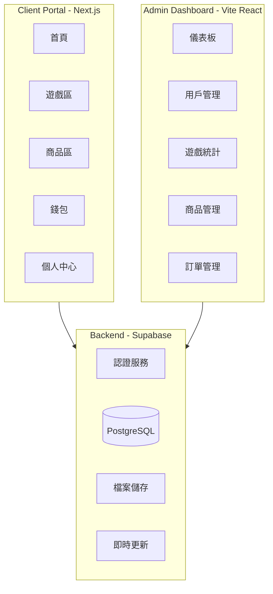

# vAcAnt 虛擬博弈網站作品集開發計劃

## 專案架構總覽



## 技術棧

- **前端用戶端**: Next.js 16 + React 19 + Tailwind CSS 4
- **管理後台**: Vite + React 19
- **後端服務**: Supabase (Auth + PostgreSQL + Storage)
- **狀態管理**: Zustand
- **動畫**: Framer Motion
- **圖表**: Recharts (後台)
- **部署**: Vercel

---

## Phase 1: 基礎架構與認證系統

### 1.1 專案設定與共用元件

在 [client-portal/](client-portal/) 設定：

- 安裝必要套件: `zustand`, `framer-motion`, `@supabase/supabase-js`
- 建立深色主題的 Tailwind 配置
- 建立共用 UI 元件: Button, Card, Modal, Input, Avatar
- 設定 Supabase Client

### 1.2 認證系統

- 訪客模式: 自動建立臨時帳號並儲存於 localStorage
- Google OAuth 登入: 整合 Supabase Auth
- 登入/註冊 Modal 元件

### 1.3 資料庫設計 (Supabase)

```
users
├── id (uuid, PK)
├── email
├── display_name
├── avatar_url
├── created_at
└── is_guest (boolean)

wallets
├── id (uuid, PK)
├── user_id (FK -> users)
├── coin_balance (vAcAnt Coins)
├── btc_balance
├── eth_balance
└── updated_at

transactions
├── id (uuid, PK)
├── user_id (FK)
├── type (deposit/withdraw/bet/win/purchase)
├── currency
├── amount
├── description
└── created_at

game_history
├── id (uuid, PK)
├── user_id (FK)
├── game_type
├── bet_amount
├── win_amount
├── result (JSON)
└── played_at

achievements
├── id (uuid, PK)
├── user_id (FK)
├── achievement_type
└── unlocked_at

products
├── id (uuid, PK)
├── name
├── description
├── price (in coins)
├── category
├── image_url
├── stock
└── is_active

orders
├── id (uuid, PK)
├── user_id (FK)
├── total_amount
├── status
├── shipping_info (JSON)
└── created_at

order_items
├── id (uuid, PK)
├── order_id (FK)
├── product_id (FK)
├── quantity
└── price_at_purchase

wishlists
├── id (uuid, PK)
├── user_id (FK)
└── product_id (FK)

coupons
├── id (uuid, PK)
├── code
├── discount_type (percentage/fixed)
├── discount_value
├── min_purchase
├── expires_at
└── is_active
```

---

## Phase 2: 核心 UI 與導航

### 2.1 網站佈局

- **Header**: Logo, 導航選單, 錢包餘額, 用戶頭像
- **Sidebar** (可收合): 遊戲分類, 商店入口
- **Footer**: vAcAnt 品牌資訊, 連結

### 2.2 vAcAnt Logo 加載動畫系統

建立統一的加載動畫元件，使用品牌 Logo 搭配霓虹發光 + 淡入縮放效果。

**動畫效果組合：**

```
1. 初始狀態：Logo 縮小 (scale: 0.8)、透明 (opacity: 0)
2. 進場動畫：淡入 + 放大到正常大小 (0.5s ease-out)
3. 持續效果：霓虹發光脈動 (glow pulse, 1.5s 週期)
4. 退場動畫：淡出 + 略微放大 (0.3s ease-in)
```

**使用場景：**

| 場景         | 元件                  | 動畫行為                   |
| ------------ | --------------------- | -------------------------- |
| 網站初次載入 | `<SplashScreen>`      | 全螢幕 Logo 動畫 + 進度條  |
| 頁面切換     | `<PageTransition>`    | 小型 Logo 居中 + 發光脈動  |
| 遊戲載入     | `<GameLoadingScreen>` | Logo + 遊戲名稱 + 進度提示 |
| 資料載入中   | `<LogoLoader>`        | 小型 Logo 脈動效果         |

**技術實現：**

- 使用 Framer Motion 的 `motion.div` 處理淡入縮放
- CSS `filter: drop-shadow()` + `@keyframes` 做霓虹發光效果
- 發光主色：青色 (#00ffff) 配合深色主題
- 建立 `components/loading/` 資料夾統一管理

**元件檔案結構：**

```
client-portal/src/components/loading/
├── SplashScreen.tsx      # 初次載入全螢幕
├── PageTransition.tsx    # 頁面切換過渡
├── GameLoadingScreen.tsx # 遊戲載入畫面
├── LogoLoader.tsx        # 小型載入指示器
└── useLoading.ts         # 載入狀態 hook
```

### 2.3 主要頁面路由

```
/                    # 首頁 (遊戲總覽 + 精選商品)
/games               # 遊戲大廳
/games/slots         # 老虎機列表
/games/slots/[id]    # 單一老虎機遊戲
/games/blackjack     # 二十一點
/games/baccarat      # 百家樂
/games/lottery       # 彩票遊戲
/shop                # 商品列表
/shop/[id]           # 商品詳情
/cart                # 購物車
/checkout            # 結帳
/profile             # 個人中心
/profile/history     # 遊戲歷史
/profile/orders      # 訂單歷史
/profile/achievements # 成就
/wallet              # 錢包
```

---

## Phase 3: 虛擬貨幣與錢包系統

### 3.1 錢包功能

- 餘額顯示 (vAcAnt Coins + BTC + ETH)
- 幣別切換功能
- 模擬充值介面 (點按鈕即可加錢)
- 模擬提領介面 (純 UI 展示)
- 交易紀錄列表 (篩選、分頁)

### 3.2 免費領取系統

- 「領取免費幣」按鈕
- 每次領取 1,000 vAcAnt Coins (無限制)
- 記錄到交易紀錄

---

## Phase 4: 博弈遊戲

### 4.1 老虎機 (Slots) - 3 個主題

| 主題               | 說明               |
| ------------------ | ------------------ |
| **vAcAnt Classic** | 品牌主題，馬的圖案 |
| **Cyber Neon**     | 賽博龐克風格       |
| **Lucky Fortune**  | 東方風格，財神元素 |

功能:

- 3x5 格子轉盤
- 轉動動畫 (Framer Motion)
- 連線判定與獎勵計算
- 自動轉/快速轉模式
- 下注金額調整

### 4.2 二十一點 (Blackjack)

- 標準玩法: 要牌/停牌/雙倍/分牌
- 撲克牌動畫
- AI 莊家邏輯
- 賠率顯示

### 4.3 百家樂 (Baccarat)

- 閒/莊/和 下注
- 發牌動畫
- 計分板/路單 (簡化版)

### 4.4 彩票遊戲

| 遊戲         | 說明                   |
| ------------ | ---------------------- |
| **轉盤抽獎** | 幸運轉盤，不同獎項區塊 |
| **刮刮樂**   | 可刮開的卡片效果       |
| **數字彩票** | 選號碼，定時開獎       |

---

## Phase 5: 購物車與商品系統

### 5.1 商品展示

- 商品卡片元件 (圖片、名稱、價格、加入購物車)
- 商品詳情頁 (大圖、描述、數量選擇)
- 分類篩選 (服飾/數位/收藏品)

### 5.2 商品清單 (5-10 個)

| 類別     | 商品範例                           |
| -------- | ---------------------------------- |
| 服飾     | vAcAnt Logo Tee, Neon Horse Hoodie |
| 數位商品 | 專屬頭像 , VIP 會員資格            |
| 收藏品   | 限量馬雕像, 簽名海報               |

### 5.3 購物車功能

- 加入/移除商品
- 調整數量
- 優惠券輸入與驗證
- 計算總價 (含折扣)
- 願望清單

### 5.4 結帳流程

1. 購物車確認
2. 收件資訊填寫 (模擬)
3. 確認訂單
4. 扣除 vAcAnt Coins
5. 訂單完成頁面

---

## Phase 6: 用戶個人中心

### 6.1 個人資料

- 顯示/編輯用戶名稱
- 頭像上傳 (Supabase Storage)
- 帳戶統計摘要

### 6.2 遊戲歷史

- 列表顯示所有遊戲紀錄
- 篩選 (依遊戲類型/日期)
- 統計: 總遊戲次數、總贏取金額

### 6.3 成就系統

| 成就     | 條件              |
| -------- | ----------------- |
| 新手上路 | 完成第一場遊戲    |
| 幸運之星 | 單次贏取 10,000+  |
| 購物狂   | 完成第一筆訂單    |
| 收藏家   | 擁有 3 個以上商品 |
| VIP 玩家 | 總遊戲次數達 67   |

### 6.4 訂單歷史

- 訂單列表
- 訂單詳情 (商品、金額、狀態)

---

## Phase 7: 管理後台

在 [admin-dashboard/](admin-dashboard/) 開發:

### 7.1 儀表板首頁

- 總用戶數
- 今日活躍用戶
- 總遊戲次數
- 總交易金額
- 圖表: 每日活躍用戶趨勢、遊戲類型分布

### 7.2 用戶管理

- 用戶列表 (搜尋、分頁)
- 用戶詳情 (餘額、遊戲記錄、訂單)
- 停權/啟用功能

### 7.3 遊戲統計

- 各遊戲的遊玩次數
- 獲利/虧損統計
- 熱門時段分析

### 7.4 交易紀錄

- 所有交易列表
- 篩選 (類型/日期/金額)

### 7.5 商品管理

- 商品 CRUD
- 圖片上傳
- 庫存管理

### 7.6 訂單管理

- 訂單列表
- 更新訂單狀態
- 訂單詳情

### 7.7 網站設定

- 免費幣領取金額設定
- 優惠券管理

---

## Phase 8: 收尾與部署

### 8.1 響應式設計

- 確保所有頁面在手機/平板上正常顯示
- 遊戲介面的觸控優化

### 8.2 效能優化

- 圖片優化 (Next.js Image)
- 程式碼分割
- Loading 狀態處理

### 8.3 部署

- 設定 Vercel 專案
- 環境變數配置
- 建立 Production Supabase 專案

### 8.4 README 與文檔

- 專案說明
- 技術架構圖
- 如何本地運行

---

## 建議開發順序

為了讓你能盡快有東西可以展示，建議按以下優先順序開發:

1. **先做核心體驗**: 首頁 + 1個老虎機遊戲 + 錢包基本功能
2. **完善遊戲區**: 其他遊戲
3. **加入購物功能**: 商品 + 購物車
4. **用戶系統**: 認證 + 個人中心
5. **管理後台**: 基本 CRUD + 圖表
6. **細節打磨**: 動畫 + 響應式 + 優化
